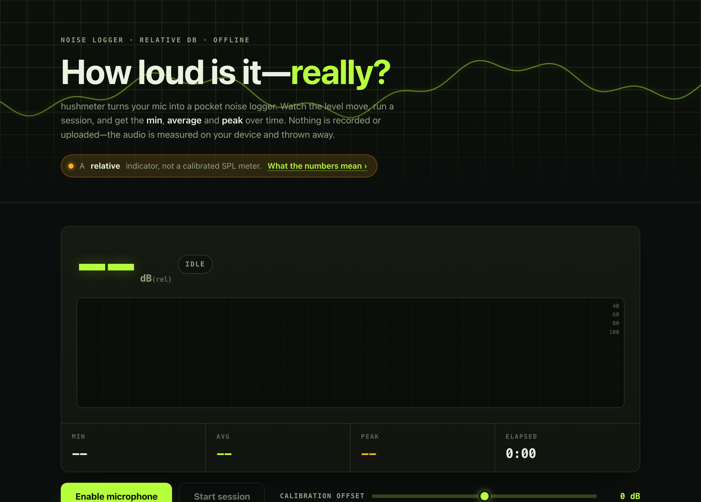

# hushmeter

**How loud is it — really?** A pocket noise-level logger that measures how loud a space is using your device's microphone and charts the level over time — with the minimum, average and peak for each session. 100% client-side, zero dependencies, works fully offline. Nothing is recorded or uploaded.

## Why

You can *feel* that a room is loud, but you can't compare it — the café you thought was quieter than the office, the nursery at 9pm versus 2am, the fan on low versus high. Most phone noise apps bury a simple reading under ads, accounts, and permissions you can't verify, and many quietly upload data.

hushmeter is the opposite: open the page, allow the mic, and watch a live level with a moving waveform. Press **Start session** to log the level over time and get a clean min / average / peak, then name it ("Baby's room, 9pm") and save it. Everything — the audio analysis and the saved sessions — happens on your device. You can prove it: a strict Content-Security-Policy forbids the app from making *any* network request.

## Features

- **Live meter** — a big current level, a moving oscilloscope-style waveform, and a colour-plus-text band (Quiet / Moderate / Loud / Hearing risk) so it never relies on colour alone.
- **Sessions over time** — start and stop a measurement; hushmeter samples the level a few times a second and draws a timeline chart, tracking running min, average and peak.
- **Saved history** — name and tag each session, reopen it to view its chart, delete it, or **export it as CSV** (`timestamp,level`) or a text summary.
- **Calibration offset** — a simple dB offset slider so, if you have a reading you trust, you can align hushmeter to it. The offset is remembered on your device.
- **Reference guide** — an indicative table of what typical dB levels mean, from a whisper (~30) to hearing-risk territory (85+).
- **Private by construction** — no accounts, no network, no analytics, no external assets. The microphone stream is connected only to a Web Audio analyser — never to a media element — so nothing is ever played back, recorded, or written to a file.

## Quickstart

Just open `index.html` in any modern browser — no build step, no server, no install. Grant microphone permission when asked.

- **Local:** double-click `index.html`, or run a static server in the folder (some browsers only allow mic access over `http://localhost` or `https://`, so a tiny local server is the most reliable way to try it).
- **Hosted:** **[Open hushmeter live](https://sreenivas-sadhu-prabhakara.github.io/hushmeter/)**

Your saved sessions and calibration offset live in your browser's local storage on this device only. They are not synced or backed up — export a session to CSV if you want a copy to keep.

## Privacy

hushmeter is built so you don't have to take its word for it.

- A strict Content-Security-Policy sets `connect-src 'none'`: the app **cannot** make any network request, even if it tried.
- The microphone stream is routed into a Web Audio `AnalyserNode` only. It is never attached to an `<audio>` or `<video>` element, never sent to the speakers, and never recorded to a file or a `MediaRecorder`.
- No external fonts, scripts, images, or analytics. Everything is self-contained and runs offline.
- Only the numeric session summaries you choose to save are stored, and they stay in local storage on your device.

## Accuracy — read this

hushmeter is **not a calibrated sound-level meter.** Consumer microphones are uncalibrated, their frequency response varies wildly, and most phones and laptops apply automatic gain control that raises quiet sounds and pulls down loud ones. hushmeter turns the microphone's signal into a *relative* loudness indicator and even applies a modest smoothing and an optional calibration offset — but it can never be certified decibels.

Use it to **compare**: this room versus that one, now versus later, before versus after you change something. Do **not** use it to decide whether a workplace is within legal noise limits, whether a sound is medically harmful, or anything else where a real measurement matters. For that, use a calibrated SPL meter and follow the applicable regulations.

## Disclaimer

hushmeter provides a relative, indicative loudness reading for general awareness and educational purposes only. It is **not** a calibrated sound-level meter and is **not** professional acoustic, occupational-health, medical, engineering, or legal advice. Readings are uncalibrated and affected by your microphone and automatic gain control, and must not be used for occupational, medical, or legal noise-compliance decisions. This software is provided under the MIT License, "as is", without warranty of any kind; the authors accept no liability for any loss, injury, or damage arising from its use.

## License

[MIT](./LICENSE) © 2026 Sreenivas Sadhu Prabhakara
